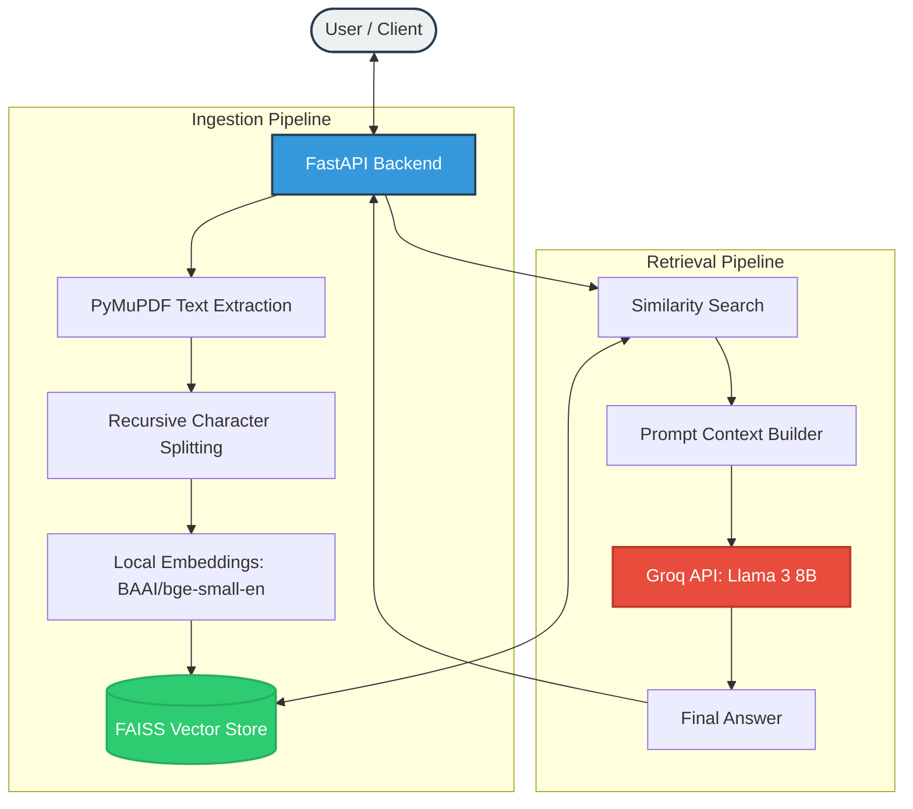

# DocuMindAI 

> RAG-based Document Intelligence Chatbot — upload PDFs, ask questions, get grounded answers.

[](https://fastapi.tiangolo.com)
[](https://langchain.com)
[](https://faiss.ai)
[](https://react.dev)

## Architecture

The system follows a standard RAG (Retrieval-Augmented Generation) pattern, optimized for low latency and high accuracy using local embeddings and high-performance inference.



> [!TIP]
> You can find the editable diagram source at [diagrams/architecture.drawio](diagrams/architecture.drawio). Use [draw.io](https://app.diagrams.net/) to view or edit it.

## Tech Stack

| Layer | Technology |
|-------|-----------|
| Backend API | FastAPI + Uvicorn |
| RAG Framework | LangChain |
| Vector Store | FAISS (CPU) |
| PDF Parsing | PyMuPDF (fitz) |
| Embeddings | BAAI/bge-small-en-v1.5 (Local HuggingFace) |
| LLM | Llama 3 8B (via Groq API) |
| Frontend | React 18 + Vite |
| Containerisation | Docker + Docker Compose |

## Quick Start

### 1. Clone & configure

```bash
git clone https://github.com/deepuzz11/DocuMindAI.git
cd DocuMindAI

cp backend/.env.example backend/.env
# Edit backend/.env → add your GROQ_API_KEY (get it at https://console.groq.com)
```

### 2. Run with Docker (recommended)

```bash
docker-compose up --build
```

- Backend: http://localhost:8000
- Frontend: http://localhost:3000
- API docs: http://localhost:8000/docs

### 3. Run locally (dev)

```bash
# Backend
cd backend
python -m venv venv && source venv/bin/activate
pip install -r requirements.txt
uvicorn main:app --reload

# Frontend (separate terminal)
cd frontend
npm install
npm run dev
```

## API Reference

| Method | Endpoint | Description |
|--------|----------|-------------|
| `POST` | `/api/v1/upload` | Upload & ingest a document |
| `POST` | `/api/v1/chat` | Ask a question (JSON response) |
| `POST` | `/api/v1/chat/stream` | Ask a question (SSE streaming) |
| `GET`  | `/api/v1/documents` | List all indexed documents |
| `DELETE` | `/api/v1/documents/{id}` | Remove a document from the index |

## Key Design Decisions

**Why FAISS over Pinecone/Weaviate?**  
Zero infra overhead, runs locally, persists to disk. Perfect for a portfolio project — you control everything.

**Why RecursiveCharacterTextSplitter?**  
Respects natural text boundaries (paragraphs → sentences → words) before falling back to character splits. Better context coherence than naive fixed-size splitting.

**Why chunk_overlap=200?**  
Prevents cutting off context at chunk boundaries — a sentence split across two chunks is still fully represented in both.

**Document deletion via rebuild?**  
FAISS doesn't support per-vector deletion. The rebuild-on-delete pattern is correct for small-to-medium corpora and keeps the implementation simple.

## License

MIT